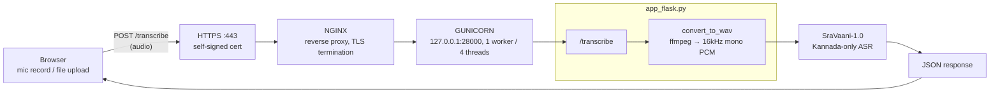

# Pragna Vaani — Architecture

## Overview

Pragna Vaani is a Kannada speech-recognition tool: **Kannada speech in,
Kannada text out**, nothing else. `app_flask.py` is a thin Flask API
wrapping a single pretrained ASR model (`ARTPARK-IISc/SraVaani-1.0`),
served over a vanilla JS/HTML frontend. The app was originally a
multilingual-to-Kannada translator (Whisper + NLLB-200 in addition to
SraVaani) but that pipeline was removed by design — see "Why Kannada-only"
below — since SraVaani alone was reliable and the translation path wasn't.

A second, standalone Gradio UI (`simple_ui.py`) and a couple of CLI
scripts still exist with the old multilingual pipeline; they were left
as-is rather than updated (see Entrypoints).

## Runtime component diagram



### Why Kannada-only (multilingual mode removed)

The app used to support a second mode: detect the spoken language with
Whisper, then translate to Kannada via NLLB-200 for anything that wasn't
already Kannada. In practice:

- Whisper (any size, any inference library) produced garbled multi-script
  gibberish on Kannada audio — even on known-clean samples — while
  SraVaani transcribed the same audio perfectly. Whisper is simply weak on
  Kannada specifically (low-resource in its training data).
- Swapping `openai-whisper` for `faster-whisper` (int8) made inference
  2–6x faster (`base`: ~17s → ~3–11s per request on this host) with no
  accuracy change, but going up to `small` for better accuracy measured
  **274s (4.6 min) per request** — non-viable for a live web request — and
  didn't show a clear quality win on the Kannada test samples available
  anyway.
- With Kannada ASR working reliably and consistently, and no non-Kannada
  sample audio in this repo to properly validate translation quality, the
  simpler and more trustworthy choice was to drop the multilingual path
  entirely rather than ship an unverified translation feature alongside a
  proven one.

`app_flask.py` now loads and calls only SraVaani. Whisper and NLLB-200 are
no longer imported or loaded by the production app at all — `faster-whisper`
was removed from `requirements.txt` as a result. (`openai-whisper` remains,
since `simple_ui.py` and `english_to_kannada.py` still depend on it.)

## Production deployment (nginx + gunicorn + TLS)

The Flask dev server (`app.run(debug=True)`) is no longer the externally
reachable entrypoint. Traffic now flows:

```
Browser → HTTPS :443 → NGINX (TLS termination) → GUNICORN (127.0.0.1:28000) → app_flask:app
```

| Layer | Detail |
|---|---|
| **NGINX** | System package, `server` block in `/etc/nginx/sites-available/pragna-vaani`, listens on `443` only (see "Why port 443 only" below). Terminates TLS, proxies to Gunicorn, `client_max_body_size 100M` (matches Flask's own limit), `proxy_read_timeout 180s`. |
| **TLS cert** | Self-signed, `/etc/nginx/ssl/vaani.{crt,key}`, `subjectAltName` includes `IP:103.171.116.134` and `IP:127.0.0.1` (required — browsers reject IP-only certs without a matching SAN). No domain was available, so Let's Encrypt (which requires domain validation) isn't usable; visitors see a one-time browser warning to click through. |
| **GUNICORN** | Installed in the project venv. Runs as systemd service `pragna-vaani`, bound to `127.0.0.1:28000` (internal only — not reachable from outside the box). `--workers 1 --threads 4`. Single worker was originally to avoid multiplying the ~5GB+ RAM footprint of three loaded models; now there's only one model (SraVaani), but the setting was left as-is since it still works fine and there was no pressure to revisit it. |
| **systemd units** | `pragna-vaani.service` (gunicorn, `WantedBy=multi-user.target`, `Restart=on-failure`) and the standard `nginx.service`. Both `enabled`, so they come back up on reboot. |
| **Old dev port 2000** | Stopped. `app_flask.py` is no longer run directly (`python app_flask.py`) in production — that path also carried the Werkzeug debug-mode RCE risk noted below and would have bypassed TLS entirely. |
| **`HF_HUB_OFFLINE=1` / `TRANSFORMERS_OFFLINE=1`** | Set on the systemd service. SraVaani is fully cached locally, so startup never needs the network — added after a restart once stalled with a worker stuck in `CLOSE-WAIT` on a Hugging Face Hub cache-validation call. Forcing offline mode removes that class of failure entirely. |

### Why port 443 only (not 80, no HTTP→HTTPS redirect)

This host is shared with several other services, and port `80` is already
held by an existing **Nextcloud** instance
(`snap.nextcloud.apache.service`, Apache `httpd`). Installing nginx's
default config would have conflicted with it. The `pragna-vaani` nginx site
listens only on `443`; port `80` was left completely untouched. There's no
`http://` → `https://` redirect for this app as a result — it's HTTPS-only
by omission, which is fine since a self-signed cert makes plain HTTP
pointless anyway.

### Why internal port 28000

The host runs many other Docker Compose stacks (`ai_attendance-*`,
`open-project-*`, `ai-interviewer-*`, etc.) with their own port
allocations. The conventional choice (`127.0.0.1:8000`) was already taken
by `ai_attendance-backend-1`; `28000` was picked after checking the full
listening-port list for a collision.

### Reproducing this setup elsewhere

```bash
# 1. venv deps
source .venv/bin/activate && pip install gunicorn

# 2. self-signed cert (adjust IP/SAN as needed)
sudo mkdir -p /etc/nginx/ssl
sudo openssl req -x509 -nodes -days 825 -newkey rsa:2048 \
  -keyout /etc/nginx/ssl/vaani.key -out /etc/nginx/ssl/vaani.crt \
  -subj "/CN=<YOUR_IP>" \
  -addext "subjectAltName=IP:<YOUR_IP>,IP:127.0.0.1"

# 3. systemd service → /etc/systemd/system/pragna-vaani.service
#    ExecStart = <venv>/bin/gunicorn --workers 1 --threads 4 --timeout 180 \
#                --bind 127.0.0.1:28000 app_flask:app
#    Environment="PATH=<venv>/bin:/usr/local/sbin:/usr/local/bin:/usr/sbin:/usr/bin:/sbin:/bin"
#    Environment="HF_HUB_OFFLINE=1"
#    Environment="TRANSFORMERS_OFFLINE=1"
#    ^ PATH must include system PATH, not just the venv — otherwise `ffmpeg`
#      (called via subprocess in convert_to_wav()) isn't found. This bit
#      once in the initial rollout (see Known issues).

# 4. nginx site → /etc/nginx/sites-available/pragna-vaani, symlinked into
#    sites-enabled/, listen 443 ssl only, proxy_pass to 127.0.0.1:28000

sudo systemctl daemon-reload
sudo systemctl enable --now pragna-vaani
sudo systemctl enable --now nginx
```

## Entrypoints

| File | Role | Port | Status |
|---|---|---|---|
| `app_flask.py` | Primary web app — Flask REST API + HTML/JS frontend. Kannada-only (SraVaani). | 2000 (dev) / behind nginx:443 (prod) | Active, currently used |
| `simple_ui.py` | Alternate standalone Gradio UI. **Still has the old multilingual pipeline** (SraVaani + `openai-whisper` + NLLB-200) — not updated when `app_flask.py` was simplified to Kannada-only. | 7860 | Independent experiment, not wired to `app_flask.py` |
| `english_to_kannada.py` | CLI-only class (`EnglishToKannadaTranslator`): English audio → Kannada text, via `openai-whisper` + NLLB-200 | — | Standalone script, not imported elsewhere |
| `transcribe.py` | Minimal CLI smoke test for the Kannada ASR model | — | Broken: references an undefined `TOKEN` variable |
| `test_vaani.py` | Environment/setup diagnostic (checks Python version, deps, ffmpeg, loads model, runs one test transcription) | — | Standalone dev tool |

## Model

`ARTPARK-IISc/SraVaani-1.0` — FastConformer-based Kannada-only ASR, pulled
from the Hugging Face Hub and cached under `~/.cache/huggingface` (already
warm on this deployment; startup runs fully offline, see
`HF_HUB_OFFLINE` above). Loaded via
`AutoModel.from_pretrained(..., trust_remote_code=True)`, runs on **CPU**
(`DEV = 'cpu'`). `HF_TOKEN` (from `.env`) is only needed if the repo is
gated.

`simple_ui.py` and `english_to_kannada.py` still separately load Whisper
and NLLB-200 in addition to SraVaani — those are unrelated to the
production `app_flask.py` path (see Known issue: duplicated model
loading).

## Request flow — `app_flask.py`

### `GET /`
Renders `templates/index.html`.

### `POST /transcribe`
Multipart form: `audio` (file) only — no mode parameter.

1. Validate file extension (`ALLOWED_EXTENSIONS`).
2. Save upload to `uploads/<uuid>.<ext>`.
3. `convert_to_wav()` — shells out to `ffmpeg` to normalize to mono/16kHz
   PCM WAV in a temp file; re-validated by loading with `soundfile`.
4. `asr_model.transcribe()` (SraVaani) directly on the WAV.
5. `add_kannada_punctuation()` appends a Kannada danda (`।`) if the result
   doesn't already end in punctuation.
6. The converted scratch WAV is deleted; the original upload is kept so
   `/audio/<filename>` can serve it back for playback.
7. Respond with JSON: `{success, result, audio_url}`.

### `GET /audio/<filename>`
Serves the original upload back to the browser for playback.

## Frontend — `templates/index.html`

Single static page, no build step, no frontend framework, no mode toggle.

- Audio input via drag-and-drop/file picker, or in-browser recording via
  `MediaRecorder` (`getUserMedia`, no `timeslice`, entire recording
  delivered in one blob on `stop()`).
- `fetch('/transcribe', {method: 'POST', body: formData})`; renders the
  Kannada result text and an audio player for playback.

## Known issues (observed while running the app)

1. ~~`/audio/<filename>` always 404s~~ — **Resolved.** `transcribe()` used
   to delete `uploaded_file_path` via `cleanup_file()` before returning
   `audio_url` pointing at that same now-deleted file. Fixed by only
   cleaning up the ffmpeg scratch WAV (`temp_file`) and keeping the
   original upload around for `/audio/<filename>` to serve. Also fixed
   `serve_audio()`, which hardcoded `mimetype='audio/wav'` regardless of
   the actual uploaded file type — now lets `send_file` infer the mimetype
   from the extension. Trade-off: uploads now persist longer, compounding
   known issue 6 below (accepted, since playback needs the file to exist).
2. ~~Flask debug mode bound to `0.0.0.0`~~ — **Resolved.** Production
   traffic now goes through gunicorn (`app_flask:app`, imported directly),
   so the `if __name__ == '__main__': app.run(debug=True, ...)` block never
   executes in this deployment. The old dev server on port 2000 has been
   stopped; gunicorn only binds `127.0.0.1:28000` (not reachable from
   outside). See "Production deployment" above.
3. ~~No HTTPS~~ — **Resolved.** nginx now terminates TLS on `443` with a
   self-signed cert covering the server's public IP. Mic recording
   (`getUserMedia`) works once a visitor accepts the browser's one-time
   self-signed-cert warning. See "Production deployment" above for why it's
   self-signed rather than a CA-issued cert (no domain available).
4. **Duplicated model loading, now also diverged.** `simple_ui.py` still
   independently loads all three original models (SraVaani + Whisper +
   NLLB) at import time — no shared module with `app_flask.py`, and now
   the two aren't even functionally equivalent (`app_flask.py` is
   Kannada-only; `simple_ui.py` still does multilingual translation).
   Running both at once also still roughly doubles memory/CPU usage for
   the SraVaani portion.
5. **`transcribe.py` is broken** — references an undefined `TOKEN` at
   module scope; the comment above it says the token was intentionally
   removed but the reference wasn't updated.
6. **`uploads/` accumulates files.** Every successfully processed upload
   now persists indefinitely (needed for `/audio/<filename>` playback, see
   issue 1), and anything left behind by a crashed request does too.
   `.gitignore` blocks common audio extensions from being committed, but
   the directory itself isn't cleared on startup or swept periodically.

## Configuration

- **`.env`** (from `.env.example`): `HF_TOKEN` — only required if
  `ARTPARK-IISc/SraVaani-1.0` is gated on Hugging Face.
- **`requirements.txt`**: `flask`, `flask-cors`, `gradio`, `torch`,
  `transformers`, `sentencepiece`, `openai-whisper` (used by `simple_ui.py`
  / `english_to_kannada.py`, not `app_flask.py`), `gunicorn`, `soundfile`,
  `python-dotenv`.
- **System dependency**: `ffmpeg` (audio format conversion; not in
  `requirements.txt` since it's a system binary, not a Python package).

## Repo layout reference

```
app_flask.py           primary Flask app — Kannada-only (see above)
simple_ui.py           alternate Gradio UI (still multilingual, diverged)
english_to_kannada.py  standalone CLI, English audio → Kannada text
transcribe.py          minimal CLI smoke test (Kannada ASR only) — broken
test_vaani.py          environment/setup diagnostic script
templates/index.html   frontend for app_flask.py
requirements.txt       Python dependencies
.env.example           HF_TOKEN template
uploads/                runtime scratch dir for saved audio (see issue 6)
examples/, docs/       sample Kannada audio clips for manual testing
```
